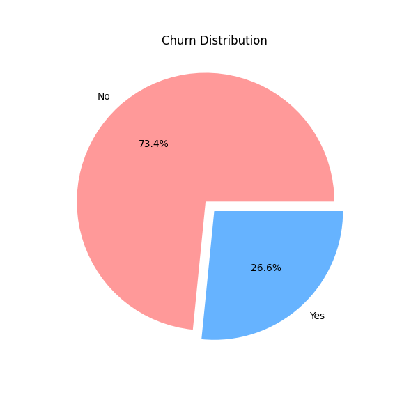

# Customer Churn Prediction

This project aims to predict customer churn in a telecom company using various machine learning models. The analysis is done on the Telco Customer Churn dataset.

## Table of Contents
- [Introduction](#introduction)
- [Dataset](#dataset)
- [Methodology](#methodology)
- [Models Used](#models-used)
- [Results](#results)
- [Visualizations](#visualizations)
- [How to Run](#how-to-run)
- [Dependencies](#dependencies)

## Introduction

Customer churn is a critical metric for businesses. This project focuses on building a model that can predict which customers are most likely to churn, allowing the company to take proactive measures to retain them.

## Dataset

The dataset used is the "Telco-Customer-Churn.csv" file, which contains information about 7043 customers and 21 attributes, including:

-   **Customer Demographics:** gender, SeniorCitizen, Partner, Dependents
-   **Services Subscribed:** PhoneService, MultipleLines, InternetService, OnlineSecurity, OnlineBackup, DeviceProtection, TechSupport, StreamingTV, StreamingMovies
-   **Account Information:** tenure, Contract, PaperlessBilling, PaymentMethod, MonthlyCharges, TotalCharges
-   **Target Variable:** Churn (Yes or No)

## Methodology

1.  **Data Loading and Initial Analysis:** The dataset is loaded using pandas, and initial exploration is done to understand the data's structure, data types, and basic statistics.
2.  **Data Cleaning and Preprocessing:**
    *   The `customerID` column is dropped as it is not relevant for prediction.
    *   The `TotalCharges` column is converted to a numeric type, and missing values are handled by filling them with the column's median.
    *   Categorical features are label encoded.
3.  **Exploratory Data Analysis (EDA):**
    *   Visualizations are created to understand the distribution of the target variable (Churn).
    *   The relationship between different features and churn is explored using various plots like count plots, pie charts, and histograms.
4.  **Feature Scaling:** The numerical features are scaled using `StandardScaler`.
5.  **Model Building:** The dataset is split into training and testing sets, and various classification models are trained on the data.
6.  **Model Evaluation:** The performance of each model is evaluated using metrics like accuracy, precision, recall, F1-score, and the confusion matrix.

## Models Used

The following machine learning models were used to predict customer churn:

-   Decision Tree Classifier
-   Random Forest Classifier
-   Gaussian Naive Bayes
-   K-Nearest Neighbors (KNN)
-   Support Vector Machine (SVM)
-   Multi-layer Perceptron (MLP)
-   AdaBoost
-   Gradient Boosting
-   Extra Trees Classifier
-   Logistic Regression
-   XGBoost
-   CatBoost

## Results

The models were evaluated based on their accuracy scores. The CatBoost Classifier achieved the highest accuracy of **82.1%** on the test set.

## Visualizations

### Churn Distribution



### Confusion Matrix (CatBoost)


## How to Run

1.  Clone the repository:
    ```bash
    git clone https://github.com/your-username/customer-churn-prediction.git
    ```
2.  Install the required dependencies:
    ```bash
    pip install -r requirements.txt
    ```
3.  Open and run the `CUSTOMER_CHURN_PREDICTION.ipynb` notebook in a Jupyter environment.

## Dependencies

The main libraries used in this project are:

-   pandas
-   numpy
-   matplotlib
-   seaborn
-   plotly
-   scikit-learn
-   xgboost
-   catboost
-   missingno

You can install these dependencies using pip:
```bash
pip install pandas numpy matplotlib seaborn plotly scikit-learn xgboost catboost missingno
```
